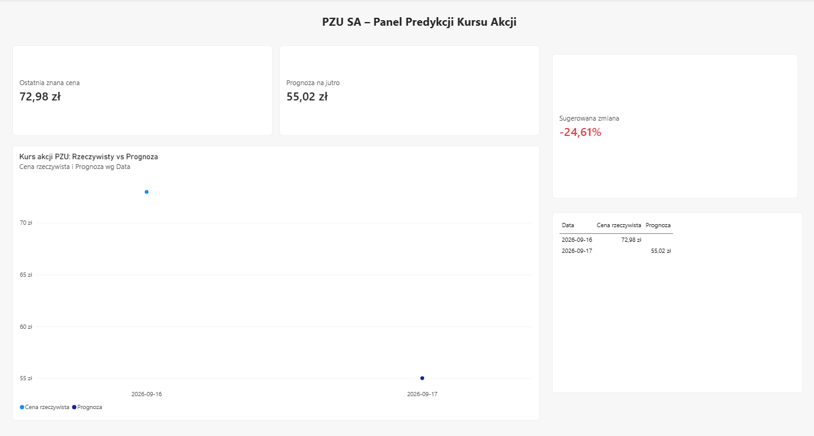

# 📈 PZU S.A. – Stock Price Prediction & Automated BI Dashboard

Zautomatyzowany system predykcji kursu otwarcia akcji PZU S.A. na kolejną sesję giełdową (GPW), wykorzystujący sieć rekurencyjną LSTM/RNN, automatyzację CI/CD za pomocą GitHub Actions oraz dynamiczny dashboard w Power BI.

---

## Architektura (Pipeline)

1. **Źródło danych:** Automatyczne pobieranie najnowszych notowań giełdowych GPW (`PZU.WA`) za pośrednictwem biblioteki `yfinance`.
2. **Model predykcyjny:** Sieć neuronowa LSTM (PyTorch) wytrenowana na 30-dniowych oknach czasowych cen otwarcia.
3. **Automatyzacja (GitHub Actions):** 
   - Workflow uruchamiany cyklicznie od poniedziałku do piątku o 19:00 UTC.
   - Skrypt `src/predict.py` generuje prognozę na kolejny dzień sesyjny i aktualizuje plik `data/predictions.csv`.
4. **Wizualizacja (Power BI):**
   - Dashboard połączony bezpośrednio z surowym plikiem na GitHubie.
   - Zaplanowane automatyczne odświeżanie w chmurze Power BI Service każdego dnia roboczego.

---

## Dashboard Power BI

Dashboard prezentuje:
- Kurs z ostatniej znanej sesji,
- Predykcję modelu na kolejną sesję,
- Sugerowaną zmianę procentową,
- Wykres porównawczy cen rzeczywistych z prognozowanymi.

**

---

## Struktura projektu

```text
├── .github/workflows/
│   └── daily_prediction.yml   # Harmonogram GitHub Actions (CRON)
├── data/
│   └── predictions.csv        # Wyniki rzeczywiste i prognozy
├── models/
│   ├── model.pth              # Wytrenowane wagi modelu LSTM
│   └── scaler.pkl             # Dopasowany skaler MinMaxScaler
├── powerbi/
│   └── pzu_stock_dashboard.pbix # Dashboard w Power BI
├── src/
│   ├── model.py               # Architektura sieci PyTorch
│   ├── train.py               # Skrypt treningowy
│   └── predict.py             # Skrypt generujący codzienne predykcje
├── requirements.txt
└── README.md